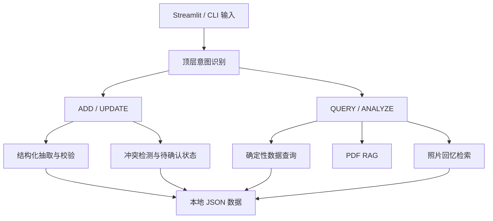

# Parenting Memory Agent

一个面向家庭育儿场景的可靠型 AI Agent。

项目支持使用自然语言记录、修改和查询宝宝的成长数据，通过 RAG 检索专业育儿资料，并将宝宝照片与成长事件关联，实现基于自然语言的照片回忆召回。

## 项目背景

宝宝的成长信息通常分散在聊天记录、照片、纸质记录和家长记忆中，难以长期整理和查询。

本项目尝试构建一个可验证、可追踪的宝宝成长记忆系统：

- 家长使用自然语言记录宝宝的成长事件。
- AI 将非结构化描述转换为结构化数据。
- 系统支持查询、修改和冲突确认。
- 成长记录可以与照片建立关联。
- 育儿问题可以基于专业资料进行 RAG 检索。
- 关键数据操作由确定性 Python 代码完成，减少大模型编造和误操作。

项目的重点不是让大模型直接处理所有数据，而是探索大模型与确定性程序之间的合理分工。

## 核心功能

### 1. 自然语言记录

用户可以输入：

```text
宝宝昨天第一次独立走了。
```

系统会：

1. 识别用户意图为 `ADD`。
2. 使用 DeepSeek 提取结构化数据。
3. 计算事件日期和宝宝当时的月龄。
4. 使用 Pydantic 校验数据。
5. 校验成功后写入宝宝档案。

### 2. 数据修改与冲突处理

用户可以使用自然语言修改历史记录。

例如：

```text
更正一下，宝宝第一次独立走路是在前天。
```

如果系统找到多个可能被修改的记录，会进入待确认状态，并要求用户选择具体记录，避免误修改数据。

用户也可以取消待处理操作。

### 3. 确定性数据查询

目前支持查询：

- 体重
- 身高
- 头围
- 发育里程碑
- 大运动
- 精细动作
- 辅食记录
- 喝奶记录
- 活动记录
- 最近一次记录

例如：

```text
宝宝最近一次大运动是什么？
```

系统会按照日期对真实记录排序，只返回最新的一条记录。

事实查询和答案格式化主要由 Python 完成，而不是让大模型直接从全部数据中自由生成答案。

### 4. 轻量多轮上下文

支持类似对话：

```text
用户：宝宝有哪些大运动记录？
用户：我是问最近一次。
```

系统会判断第二句话是对上一轮问题的补充，将两轮信息组合后重新查询。

当前只处理部分常见的短追问，不保存无限长度的对话历史。

### 5. PDF 育儿知识库 RAG

系统能够：

- 读取 PDF 和 TXT 文档。
- 保留文件名和 PDF 页码。
- 对文档进行分块。
- 对PDF提取结果进行文本清洗。
- 使用字符级 TF-IDF 计算相关度。
- 返回 Top-K 相关片段。
- 使用相关度阈值拒绝无关内容。
- 要求模型严格依据检索资料回答。
- 在答案中显示引用资料、页码和相关度。
- 拒绝汽车、股票等领域外问题。

当前知识库使用《3岁以下婴幼儿健康养育照护指南（试行）》作为演示资料。

### 6. 照片回忆

用户可以为宝宝照片填写：

- 回忆标题
- 发生日期
- 回忆描述
- 一张或多张照片

图片保存在本地文件夹中，JSON只保存图片路径，避免把图片二进制内容直接写入数据文件。

### 7. 自然语言召回照片

例如用户查询：

```text
宝宝第一次独立走路是什么时候？
```

系统会：

1. 查询宝宝的结构化成长记录。
2. 检索与问题相关的照片回忆。
3. 返回事件日期、文字描述和对应照片。

照片召回使用事件标题和描述进行检索。目前尚未自动识别照片画面内容。

### 8. Streamlit 演示界面

网页目前包含三个入口：

- 宝宝档案
- 照片回忆
- 育儿知识库

项目同时保留命令行版本，便于独立调试核心Agent流程。

## 系统架构



## Agent处理流程

```text
用户输入
    ↓
顶层意图识别：ADD / UPDATE / QUERY
    ↓
┌───────────────────────────────────┐
│ ADD：抽取 → 校验 → 计算日期 → 保存 │
│ UPDATE：匹配 → 冲突确认 → 修改      │
│ QUERY：分类 → 查询 → 确定性回答      │
└───────────────────────────────────┘
    ↓
返回文字、引用资料或关联照片
```

## 可靠性设计

### Pydantic结构化校验

DeepSeek返回的数据会经过 Pydantic 模型校验。

如果JSON无法解析、字段类型错误或包含不允许的额外字段，系统会抛出项目自己的 `ExtractionError`，阻止错误数据进入宝宝档案。

### 数据写入安全

项目测试会确认：

> 当AI抽取或Pydantic校验失败时，`save_baby()` 不会被调用。

### 确定性查询与回答

体重、身高、头围、发育和辅食等事实查询由Python完成。

这样可以保证：

- 不修改真实数据。
- 不编造不存在的记录。
- 相同数据产生稳定结果。
- 时间排序可以被自动测试。

### 模型输出兜底

大模型负责理解自然语言，Python负责检查关键参数。

例如模型错误地把“最近一次”识别成具体技能时，系统会清除错误参数，再使用确定性排序返回最新记录。

### 待确认状态

当修改请求对应多条候选记录时，系统不会自动选择，而是保存待处理状态并请求用户确认。

### RAG证据约束

回答中的具体数字和事实必须能够在检索资料中找到。

如果资料不足、文字残缺或相关度低，系统会拒绝回答，而不是要求模型根据自身知识补充。

### 隐私保护

以下内容不会提交到Git：

- `.env`
- `data/baby.json`
- `data/pending_action.json`
- `data/uploads/`
- 真实宝宝照片

公开演示应使用虚构数据和示例图片。

## 技术栈

- Python
- DeepSeek API
- OpenAI Python SDK
- Pydantic
- Streamlit
- scikit-learn
- PyPDF
- pytest
- JSON
- Git

项目暂未使用 LangChain 等大型Agent框架。

核心路由、状态管理、数据验证、查询、检索和评估逻辑均直接实现，以便理解、测试和控制系统行为。

## 项目结构

```text
parenting-agent/
├── data/
│   └── baby.example.json
├── evaluation/
│   ├── evaluate_intent.py
│   ├── evaluate_query.py
│   ├── evaluate_extraction.py
│   ├── evaluate_rag_retrieval.py
│   └── *_cases.py
├── knowledge/
│   └── healthy_parenting_guide_0_3.pdf
├── query/
│   ├── activity.py
│   ├── development.py
│   ├── feeding.py
│   └── growth.py
├── rag/
│   ├── retriever.py
│   └── generator.py
├── streamlit_app.py
├── router.py
├── intent.py
├── query_intent.py
├── extract.py
├── models.py
├── add_record.py
├── update_record.py
├── pending.py
├── photo_memory.py
├── photo_memory_ui.py
├── conversation.py
├── baby.py
├── answer.py
├── requirements.txt
├── .env.example
└── README.md
```

## 自动测试与评估

当前自动测试结果：

```text
35 passed
```

运行全部测试：

```bash
python -m pytest -q
```

项目包含以下大模型评估基线：

| 评估模块 | 案例数量 | 当前结果 |
|---|---:|---:|
| 顶层意图识别 | 14 | 14/14 |
| 查询意图识别 | 17 | 17/17 |
| 结构化数据抽取 | 10 | 10/10 |
| RAG检索 | 6 | 6/6 |

这些结果来自当前人工构建的回归测试集，用于比较项目迭代前后的稳定性，不代表模型在所有真实用户表达上的普遍准确率。

运行意图评估：

```bash
python -m evaluation.evaluate_intent
```

运行查询评估：

```bash
python -m evaluation.evaluate_query
```

运行抽取评估：

```bash
python -m evaluation.evaluate_extraction
```

运行RAG检索评估：

```bash
python -m evaluation.evaluate_rag_retrieval
```

## 安装与运行

### 1. 克隆项目

```bash
git clone https://github.com/XinqiZhuang/parenting-memory-agent.git
cd parenting-agent
```

创建GitHub仓库后，需要将 `<你的GitHub仓库地址>` 替换为真实地址。

### 2. 创建虚拟环境

Windows PowerShell：

```powershell
python -m venv .venv
.venv\Scripts\Activate.ps1
```

Windows CMD：

```bat
python -m venv .venv
.venv\Scripts\activate.bat
```

macOS 或 Linux：

```bash
python3 -m venv .venv
source .venv/bin/activate
```

### 3. 安装依赖

```bash
python -m pip install -r requirements.txt
```

### 4. 配置环境变量

复制环境变量示例文件。

Windows：

```powershell
Copy-Item .env.example .env
```

macOS 或 Linux：

```bash
cp .env.example .env
```

然后打开 `.env`，填写自己的 DeepSeek API Key：

```text
DEEPSEEK_API_KEY=你的API密钥
```

`.env` 包含真实密钥，不要提交到Git。

### 5. 初始化宝宝数据

首次运行时，如果本地不存在：

```text
data/baby.json
```

程序会自动读取：

```text
data/baby.example.json
```

并生成一份本地数据文件。

真实的 `baby.json` 已通过 `.gitignore` 排除，不会提交到公开仓库。

### 6. 启动Streamlit网页

```bash
python -m streamlit run streamlit_app.py
```

默认访问地址通常为：

```text
http://localhost:8501
```

### 7. 启动命令行版本

```bash
python main.py
```

输入：

```text
exit
```

可以退出程序。

## 示例问题

### 新增记录

```text
宝宝昨天第一次独立走了三步。
```

### 修改记录

```text
更正一下，宝宝第一次独立走路是在前天。
```

### 查询成长数据

```text
宝宝最近一次大运动是什么？
```

```text
宝宝最近的体重是多少？
```

```text
宝宝吃过什么辅食？
```

### 多轮追问

```text
宝宝有哪些大运动记录？
```

接着输入：

```text
我是问最近一次。
```

### 查询育儿知识库

```text
一岁宝宝每天应该睡多长时间？
```

### 召回照片

```text
宝宝第一次独立走路是什么时候？
```

## 当前限制

- 数据使用本地JSON保存，不适合多用户并发。
- 多轮上下文只支持部分常见短追问。
- 照片检索依赖人工填写的事件标题和描述。
- 尚未实现图片内容自动识别。
- 尚未实现视频解析和关键帧提取。
- RAG当前使用TF-IDF，而不是语义向量模型。
- 相关度阈值基于当前知识库和测试集确定。
- 更换知识库后需要重新评估阈值。
- 尚未实现用户登录、权限管理和云端存储。
- 本项目不提供医疗诊断。

## 后续计划

- 增加语义向量检索与重排序对比实验。
- 扩充真实表达、错误输入和边界案例。
- 增加图片内容识别和自动标签。
- 支持视频关键帧与成长事件关联。
- 将JSON存储升级为数据库。
- 增加用户登录和家庭成员权限。
- 增加模型调用日志、成本和延迟统计。
- 优化移动端照片墙和成长时间线。

## 项目思考

项目验证了一个核心判断：

> 大模型适合处理自然语言理解和信息抽取，但长期记忆、数据修改、时间排序、冲突处理和事实查询，需要由可测试的确定性程序约束。

项目从一个简单的育儿记录脚本逐步演化为包含自然语言路由、长期记忆、结构化校验、状态处理、RAG、自动评估和多媒体回忆的可演示Agent原型。