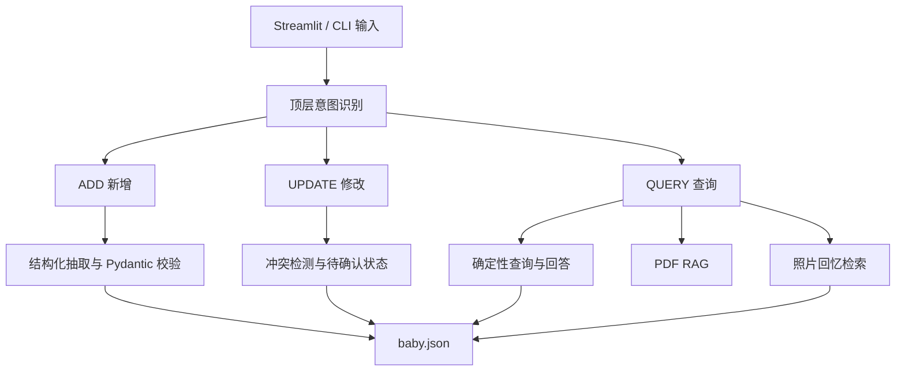

# Parenting Memory Agent

一个面向家庭育儿场景的可靠型 AI Agent。

项目支持使用自然语言记录、修改和查询宝宝的成长数据，并通过 RAG 检索专业育儿资料。同时支持上传宝宝照片、记录照片背后的成长事件，以及通过自然语言查询召回相关照片。

## 项目背景

宝宝的成长信息通常分散在聊天记录、照片、纸质记录和家长记忆中，难以持续整理和查询。

本项目尝试构建一个可验证、可追踪的育儿长期记忆系统：

- 家长使用自然语言记录宝宝的成长事件。
- AI 将非结构化描述转换成结构化数据。
- 系统支持修改、查询和多轮追问。
- 成长记录可以与照片建立关联。
- 育儿知识问题通过专业资料进行 RAG 检索。
- 关键数据操作由确定性代码完成，避免模型自由编造。

本项目的重点不是让大模型直接处理所有数据，而是探索大模型与确定性程序之间的合理边界。

## 核心功能

### 1. 自然语言成长记录

用户可以输入：

```text
宝宝昨天第一次独立走了。
```

系统识别为 `ADD`，抽取事件、日期、发育类别和月龄，并保存到宝宝档案。

### 2. 数据修改与冲突处理

用户可以通过自然语言修改历史记录。

如果系统找到多个可能的目标，会进入待确认状态，请用户选择对应记录，避免误修改数据。

### 3. 确定性数据查询

支持查询：

- 体重
- 身高
- 头围
- 发育里程碑
- 大运动与精细动作
- 辅食及喝奶记录
- 活动记录
- 最近一次记录

查询和排序主要由 Python 完成，而不是让大模型直接从全部数据中自由生成答案。

### 4. 轻量多轮上下文

支持类似对话：

```text
用户：宝宝有哪些大运动记录？
用户：我是问最近一次。
```

系统会识别第二句话是对上一轮问题的补充，并查询最新一条大运动记录。

### 5. PDF 育儿知识库 RAG

系统能够：

- 读取 PDF 和 TXT 文档。
- 保留文件名及PDF页码。
- 对文档进行分块。
- 使用字符级 TF-IDF 进行检索。
- 过滤相关度不足的结果。
- 要求模型严格依据检索资料回答。
- 在答案中显示引用资料及页码。
- 拒绝不相关的领域外问题。

当前知识库使用《3岁以下婴幼儿健康养育照护指南（试行）》进行演示。

### 6. 照片回忆与自然语言召回

用户可以为照片填写：

- 回忆标题
- 发生日期
- 文字描述
- 一张或多张照片

系统将照片文件与结构化成长事件关联。

例如查询：

```text
宝宝第一次独立走路是什么时候？
```

系统可以同时返回文字记录和对应照片。

真实照片只保存在本地，不进入 Git 仓库。

### 7. Streamlit 演示界面

网页包含三个主要入口：

- 宝宝档案
- 照片回忆
- 育儿知识库

命令行版本仍然保留，可用于单独测试核心Agent流程。

## 系统架构



## 可靠性设计

### 结构化数据校验

DeepSeek返回的数据会经过 Pydantic 校验。

如果模型输出无法解析或字段不符合约束，系统会抛出项目自己的 `ExtractionError`，并阻止错误数据写入宝宝档