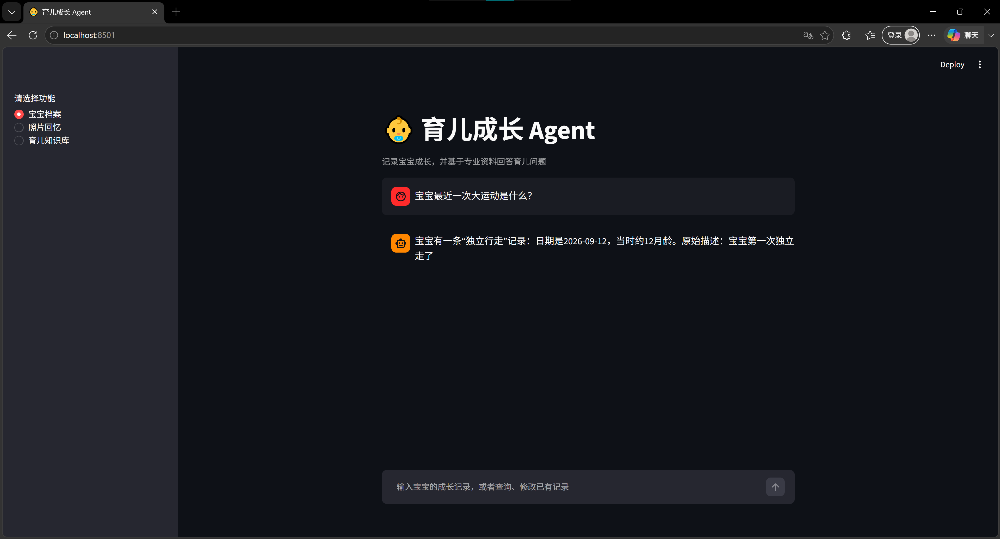
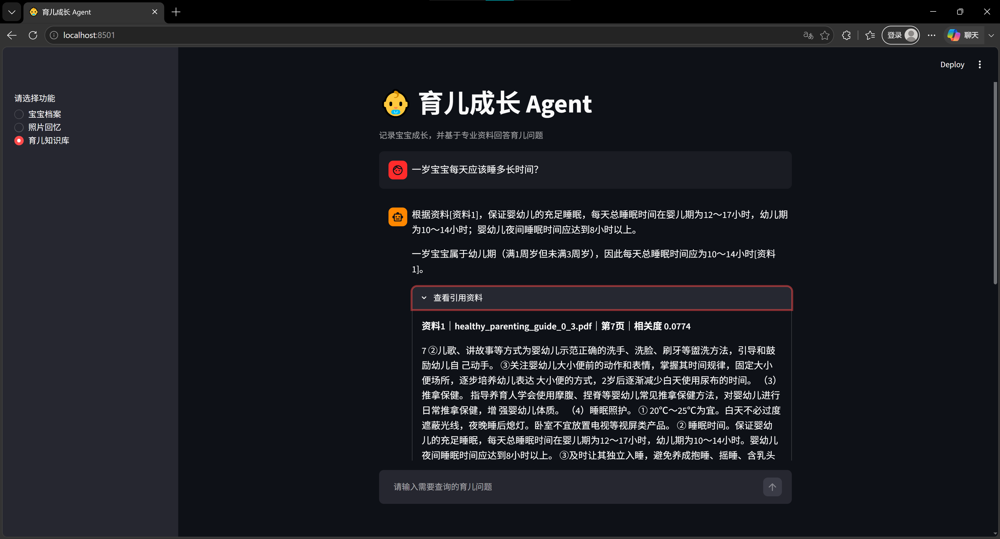
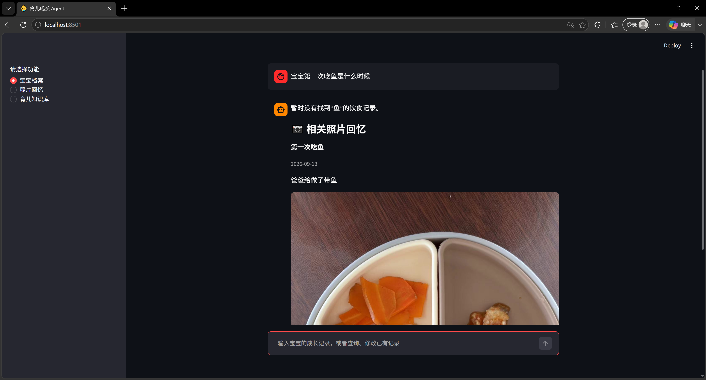

# Parenting Memory Agent

面向家庭成长记录的 AI Agent 原型：使用 DeepSeek 理解自然语言，由可测试的 Python 代码完成数据查询、写入确认、审计和撤销。支持飞书与 Streamlit，并提供带来源的育儿知识检索和照片回忆。

**项目重点：把自然语言理解、真实记录和写入权限分开，让模型提出操作，让程序校验并执行。**

## 为什么做这个项目

宝宝的成长信息分散在家长聊天、照片和日常记忆中。多个照护者共同记录时，“另外一条”“把日期补上”等表达还会引入指代、记录匹配和并发修改问题。

这个项目从个人育儿需求出发，探索如何把自然语言交互转化为可核对的操作，而不是直接让模型改写整份档案。当前定位为单家庭、单宝宝、单机运行的可演示原型。

## 已实现的功能

| 能力 | 当前实现 |
|---|---|
| 结构化成长档案 | 生长测量、发育里程碑、学习活动、喂养、健康、生活回忆六类记录 |
| 自然语言操作 | 新增、查询、修改、软删除；写入先预览，再确认 |
| 条件查询 | 名称、分类、日期范围、最新/最早记录，以及记录条数、奶量、活动时长等统计 |
| 多轮处理 | 当前会话的近期上下文；候选编号选择、取消和确认过期 |
| 家庭协作 | 飞书共享档案；按群和发送者隔离会话；配置允许访问的群或用户 |
| 操作追踪 | 保存实际写入的修改前后值；查询日志；确认后撤销本人最近一次可恢复操作 |
| 知识问答 | PDF/TXT 文本读取、分块、字符级 TF-IDF 检索、带资料来源的生成回答 |
| 照片回忆 | 网页上传照片、填写事件/日期/描述，并按这些文本召回相关照片 |

事实查询直接读取记录。无日期的记录不会被猜测为最新；最新日期并列时保留并列结果。统计的是已保存的记录，不能据此推断未记录的实际事件。

照片召回依赖人工填写的文字，目前不识别照片画面。飞书入口目前处理文字，照片上传和展示使用网页。

## 架构与分工

~~~mermaid
flowchart TD
    A["飞书 / Streamlit / CLI"] --> B["DeepSeek 解析操作"]
    B --> C["Pydantic 校验"]
    C -->|查询| D["Python 筛选与统计"]
    C -->|新增 / 修改 / 删除| E["候选消歧与预览"]
    E -->|用户确认| F["冲突检查与事务提交"]
    C -->|分析 / 知识| G["选中记录与资料检索"]
    G --> H["带来源的生成回答"]
    F --> I["JSON 档案与操作状态"]
    I --> D
~~~

- **模型负责理解**：输出统一的 Command，区分查找旧记录的 selector 和准备写入的新 values。
- **程序负责约束**：校验字段、日期和数值，执行筛选、排序、汇总，以及记录修改。
- **用户确认写入**：自然语言新增、修改、删除和撤销都会生成预览。照片上传以表单提交作为确认。
- **资料支持分析**：通用育儿问题及记录分析使用检索资料；提示模型区分档案事实与一般知识，证据不足时说明不足。此约束不等于医疗质量保证。

## 可靠性设计

| 风险 | 处理方式 |
|---|---|
| 模型输出非法字段或类型 | Pydantic 严格校验、字段白名单；无效指令停止执行 |
| 补日期被当作新增 | 统一操作协议，分离旧记录定位与新值；预览展示目标和变化 |
| 多条同名记录 | 返回候选列表，先选编号，再确认；不自动合并同名记录 |
| 家庭成员互相确认操作 | 待确认状态绑定当前会话；飞书会话包含群 ID 和发送者 ID |
| 同时修改导致覆盖 | 确认时重读并比对原记录；记录已变化则拒绝提交 |
| 重复收到飞书消息 | 保存基于消息 ID 和会话的处理回执，避免重复写入 |
| 写文件时中断或损坏 | 同机跨进程串行提交、临时文件原子替换；读取失败时不重置档案 |
| 修改后需要追溯或恢复 | 记录修改前后值；软删除；在记录未被进一步改动时支持撤销 |

数据、待确认状态、审计事件和消息回执保存在同一份 JSON 中，同一次原子替换提交。SQLite 侧文件只用于同机文件锁，**不是业务数据存储或分布式事务系统**。

首次访问旧档案时会补充稳定 ID，并保存迁移前备份；不会自动删除重复记录或补造缺失日期。

## 验证结果

截至 2026-09-20：

| 验证层次 | 结果 | 范围 |
|---|---|---|
| 离线全量回归 | 147 项通过 | Linux / Python 3.12.14；其中 V2 108 项、原项目回归 39 项 |
| 用户 Windows 验证 | V2 108 项通过 | Python 3.14.7；运行配置检查通过 |
| 真实 DeepSeek 命令解析 | 28/28 通过 | 用户本机反馈；原有 22 条及新增 6 条类别边界用例 |
| 飞书实际操作 | 用户反馈通过 | 新增、确认、查询、修改、日志、撤销、测试记录删除 |

28 条是人工构造并用于迭代的回归用例，**不是独立留出集，也不代表总体自然语言准确率**。离线测试使用模拟模型响应，覆盖错误输入、确认、消息防重、冲突、跨进程写入和会话隔离等行为；真实多人并发和医疗回答质量仍需专门评估。

一次真实评测曾将“第一次坐飞机”误分为发育里程碑。项目据此明确了生活经历、发育能力和游戏活动的分类边界，补充不同表达后复测。详细记录见 [V2 验证记录](docs/V2_VERIFICATION.md)。

## 界面预览

以下截图展示网页的成长查询、知识库引用和照片回忆；截图来自前期演示版本，V2 的写入确认与飞书流程以当前代码为准。

### 成长记录查询

### PDF 育儿知识库与引用

### 照片回忆

## 安装与运行

### 1. 获取代码并安装依赖

Windows PowerShell：

~~~powershell
git clone https://github.com/XinqiZhuang/parenting-memory-agent.git
cd parenting-memory-agent
python -m venv .venv
.\.venv\Scripts\python.exe -m pip install -r requirements.txt
~~~

后续示例直接使用虚拟环境中的 Python，无需激活脚本。若终端已激活项目的 .venv，可将命令中的 .\.venv\Scripts\python.exe 替换为 python。

macOS / Linux：

~~~bash
python3 -m venv .venv
.venv/bin/python -m pip install -r requirements.txt
~~~

### 2. 配置环境变量

仅首次配置时复制示例；已有 .env 的项目直接编辑原文件。

~~~powershell
Copy-Item .env.example .env
~~~

在 .env 中填写：

~~~dotenv
DEEPSEEK_API_KEY=你的DeepSeek密钥
DEEPSEEK_MODEL=deepseek-chat
PARENTING_DATA_DIR=data

# 使用飞书时填写
FEISHU_APP_ID=你的应用ID
FEISHU_APP_SECRET=你的应用密钥
FEISHU_ALLOWED_CHAT_IDS=你的家庭测试群ID

# 可选：进一步限制允许群内的发送者
# FEISHU_ALLOWED_USER_IDS=成员一的ID,成员二的ID
~~~

也兼容原有家庭成员配置。未配置允许群时，仅接受已配置成员或允许用户。当前所有入口共享同一份宝宝档案，因此允许群应属于同一个家庭。

相对的数据目录以项目根目录为基准。首次运行且本地不存在宝宝数据时，从 data/baby.example.json 初始化。真实配置、宝宝 JSON、照片和运行日志均应保留在本地；自定义数据目录应放在仓库外或单独加入忽略规则。

### 3. 启动网页

~~~powershell
.\.venv\Scripts\python.exe -m streamlit run streamlit_app.py --server.address 127.0.0.1
~~~

浏览器访问 http://localhost:8501 ，提供“宝宝档案”“照片回忆”“育儿知识库”三个入口。网页没有登录认证，适合本机演示。

### 4. 启动飞书机器人

需预先创建并发布具备机器人能力的飞书应用，配置消息接收事件和回复权限，并完成允许群/用户配置。项目通过 SDK 长连接接收消息，无需公网回调服务器。

~~~powershell
.\.venv\Scripts\python.exe .\feishu_bot.py
~~~

在群中 @机器人后发送文字。运行期间需要电脑和网络保持可用；按 Ctrl+C 停止。更改 .env 后重启。项目当前未提供全天候云托管。

命令行入口：

~~~powershell
.\.venv\Scripts\python.exe .\main.py
~~~

输入 exit 退出。旧版抽取和写入模块保留用于回归对照，当前聊天入口统一通过 router.py 调用 V2；旧写入脚本不应独立操作新版真实档案。

## 示例操作

| 输入 | 行为 |
|---|---|
| 记录宝宝今天第一次自己用勺子吃饭 | 提议新增发育记录，等待确认 |
| 宝宝最近一次大运动是什么 | 按有效日期查询发育记录 |
| 给没有日期的那条套杯游戏补上日期2026-08-30 | 查找活动记录；有多条时先选编号，再确认 |
| 宝宝今天喝奶总共多少毫升 | 汇总符合日期条件的已记录奶量 |
| 记录宝宝今天第一次坐飞机 | 提议新增生活回忆，等待确认 |
| 宝宝第一次站立的照片 | 查询照片回忆；网页可展示关联图片 |
| 操作日志 | 查看当前会话的写入日志 |
| 家庭操作日志 | 查看当前飞书群的写入日志 |
| 撤销上次操作 | 预览本人最近一次可恢复的写入，等待确认 |
| 取消 | 取消当前待确认操作 |

用户应核对预览中的记录、类别、日期和新值后再回复“确认”。待确认操作有效期为 20 分钟。一次支持一条记录、一个操作。

## 测试与评估

~~~powershell
# 新版离线测试
.\.venv\Scripts\python.exe -m pytest -q tests_v2

# 全量离线回归
.\.venv\Scripts\python.exe -m pytest -q

# 本地配置和数据格式检查
.\.venv\Scripts\python.exe .\verify_upgrade.py

# 真实API解析评测，会使用少量DeepSeek额度
.\.venv\Scripts\python.exe -m evaluation.evaluate_v2_parser --live
~~~

真实评测只使用脚本内的合成请求，不读取或修改真实宝宝档案。结果保存到 evaluation/results/v2_live_parser_results.json。运行配置检查成功不等于已验证真实 API 连通性。

## 代码导览

| 位置 | 职责 |
|---|---|
| agent_v2/schema.py | Command、Selector 和写入字段校验 |
| agent_v2/parser.py | 模型操作解析、分类规则与有限重试 |
| agent_v2/engine.py | 筛选、统计、候选选择、预览、确认、审计及撤销 |
| agent_v2/store.py | 同机文件锁、原子保存、稳定 ID、迁移备份 |
| agent_v2/service.py | 会话状态、消息回执与模型/数据操作的编排 |
| agent_v2/knowledge.py | 选中记录与检索证据支持的分析回答 |
| feishu_bot.py / streamlit_app.py | 飞书与网页入口 |
| rag/ / photo_memory.py | 文档检索、生成和照片回忆 |
| tests_v2/ / evaluation/ | 离线回归与真实模型评测 |

技术栈：Python、DeepSeek API、OpenAI Python SDK、Pydantic、Streamlit、飞书 Python SDK、scikit-learn、pypdf、pytest。核心编排直接使用 Python 实现，当前不依赖大型 Agent 框架。

## 当前边界与后续方向

- 模型仍可能误解需求；需要核对预览，暂不支持跨类型批量写入。
- 单家庭单机存储，不支持多租户或多个实例共享网络磁盘；日志和回执尚未实现自动归档。
- 网页未实现登录认证；飞书允许名单不等于完整的角色权限系统。
- 照片不做视觉识别；不支持语音转录、视频分析。
- RAG 使用字符 TF-IDF；阈值和文档提取质量影响结果，尚未完成语义检索对比及医疗质量评估。
- 不提供医疗诊断或药物剂量建议。带引用的生成内容仍需要核查。

后续优先扩充未见表达和多人并发场景，评估语义检索与重排序，再按使用规模考虑数据库迁移、权限细化和运行监控。
